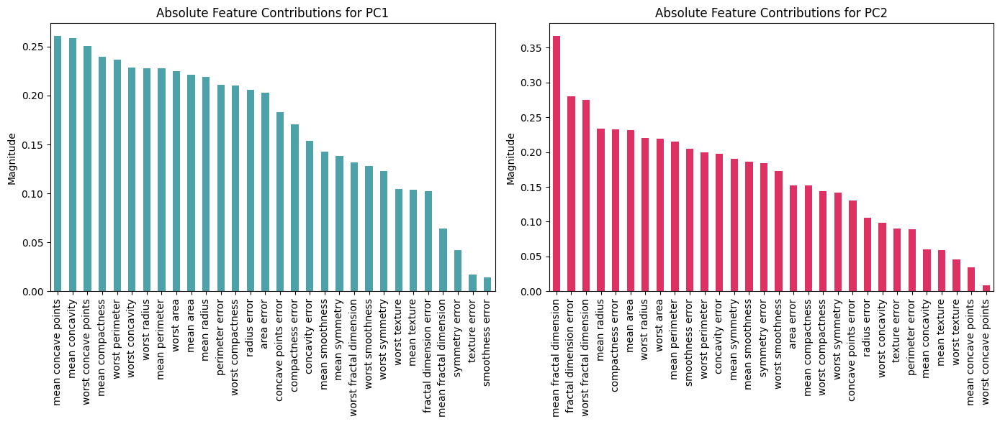

# Machine Learning Report: Classical Methods in Supervised, Unsupervised, and Graph Analysis  

This project presents a **comprehensive exploration of classical Machine Learning algorithms**, applied on multiple datasets, including:
- **IMDB Movie Reviews Dataset** (Supervised Learning)
- **Breast Cancer Dataset** (PCA and MDS)
- **Fruit Dataset** (MDS and t-SNE)
- **Zachary’s Karate Club Network** (Graph Analysis and Community Detection)

---

##  Table of Contents
1. [Supervised Learning (IMDB Sentiment Analysis)](#supervised-learning-imdb-sentiment-analysis)
2. [Unsupervised Learning (PCA, MDS, t-SNE)](#unsupervised-learning-pca-mds-t-sne)
3. [Graph Analysis (Community Detection)](#graph-analysis-community-detection)
4. [Summary and Observations](#summary-and-observations)

---

##  Supervised Learning (IMDB Sentiment Analysis)

### Goal
To classify **movie reviews as positive or negative** using three classical algorithms:
- Naïve Bayes  
- Support Vector Machine (SVM)  
- K-Nearest Neighbors (KNN)

### Dataset
50,000 labeled reviews (25k positive, 25k negative)  
Preprocessed using tokenization, stopword removal, and Bag-of-Words (CountVectorizer).

### Results

| Model | Accuracy | Precision | Recall | F1-score |
|:------|:---------:|:----------:|:--------:|:----------:|
| Naïve Bayes | **0.84** | 0.83 | 0.85 | 0.84 |
| SVM | **0.87** | 0.87 | 0.86 | 0.87 |
| KNN | **0.68** | 0.69 | 0.63 | 0.67 |

### Insights
- **SVM** achieved the best accuracy and balance between precision and recall.  
- **Naïve Bayes** served as a strong and interpretable baseline.  
- **KNN** underperformed due to high-dimensional sparsity of text features.  

---

##  Unsupervised Learning (PCA, MDS, t-SNE)

###  PCA on Breast Cancer Dataset
Dimensionality reduction from 30 → 2 features.  
Explained variance ratios: **[0.4427, 0.1897] → 63.2% total**.

| Principal Component | Dominant Features | Interpretation |
|:--------------------|:------------------|:---------------|
| **PC1** | Mean concavity, area, perimeter | Captures tumor size and shape variation |
| **PC2** | Fractal dimension, texture irregularity | Captures complexity and texture |

  

<em>Figure 1 — PCA projection: Benign and malignant samples show clear separation along PC1.</em>

  

<em>Figure 2 — Feature loadings (absolute contributions) for PC1 and PC2.</em>

---

### MDS (Multidimensional Scaling)

#### Fruit Dataset
MDS reduces 4D (mass, width, height, color_score) into 2D representation.  
Visible clustering corresponds to fruit type labels.

  

<em>Figure 3 — MDS visualization on Fruit dataset.</em>

#### Breast Cancer Dataset

  

<em>Figure 4 — MDS projection preserves distance structure between benign and malignant tumors.</em>

---

###  t-SNE (t-Distributed Stochastic Neighbor Embedding)

#### Fruit Dataset

  

<em>Figure 5 — t-SNE reveals distinct nonlinear clusters for different fruits.</em>

#### Breast Cancer Dataset

  

<em>Figure 6 — t-SNE shows well-separated clusters of malignant and benign samples.</em>

---

## 🕸 Graph Analysis (Community Detection)

### Zachary’s Karate Club Network
A classical social network of 34 members who split into two factions:  
**Mr. Hi’s group (Instructor)** and **Officer’s group (Administrator).**

  

<em>Figure 7 — Original network visualization with true social split.</em>

---

###  Hierarchical Clustering

  

<em>Figure 8 — Dendrogram from agglomerative clustering (average linkage).</em>

Cutting at height ≈ 2.0 yields two main clusters matching the real-world division.

---

### Louvain Modularity Method

Modularity-based detection identified **4 communities**  
with modularity ≈ **0.42**, revealing main factions and subgroups.

  

<em>Figure 9 — Detected communities using the Louvain method.</em>

---

###  Girvan–Newman Algorithm
Edge betweenness-based detection revealed:
- **Max modularity = 0.3850** → 5 subcommunities  
- **Two-community split (step 11)** → modularity = 0.3477  
- **ARI = 0.77**, **NMI = 0.73**, confirming high alignment with ground truth.

  

<em>Figure 10 — Concept of modularity maximization in community detection.</em>

---

##  Summary and Observations

| Domain | Method | Key Insight |
|:-------|:--------|:------------|
| **Supervised Learning** | SVM, Naïve Bayes, KNN | SVM performed best with 87% accuracy; NB was efficient baseline. |
| **Dimensionality Reduction** | PCA, MDS, t-SNE | PCA captured global variance, t-SNE revealed local structure. |
| **Graph Analysis** | Louvain, Girvan–Newman | Both accurately rediscovered the real-world community split. |

---

##  Acknowledgment
This report was developed as part of a **Foundation of Data Science course project** at  
**Sharif University of Technology**, focusing on practical experimentation with classical and graph-based learning algorithms.

---

